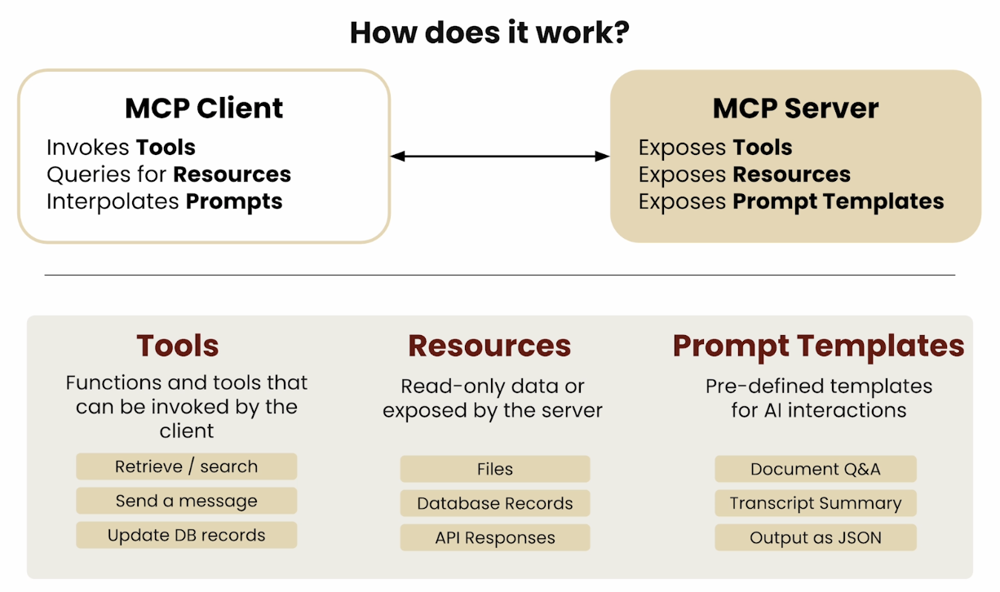

# Introduction

MCP is an open protocol that standardizes how applications provide context to LLMs. Think of MCP like a USB-C port for AI applications. Just as USB-C provides a standardized way to connect your devices to various peripherals and accessories, MCP provides a standardized way to connect AI models to different data sources and tools.

## Course Outline
- https://learn.deeplearning.ai/courses/mcp-build-rich-context-ai-apps-with-anthropic/ 
  
  
- Lesson 1: Why MCP? - video only
- Lesson 2: MCP Architecture - video only
- Lesson 3: Chatbot Example - video with code example
- Lesson 4: Creating an MCP Server - video with code example
- Lesson 5: Creating an MCP Client - video with code example
- Lesson 6: Connecting the MCP Chatbot to Reference Servers - video with code example
- Lesson 7: Adding Prompt & Resource Features - video with code example
- Lesson 8: Configuring Servers for Claude Desktop - video only
- Lesson 9: Creating and Deploying Remote Server  - video with code example 
- Lesson 10: MCP Roadmap & Conclusion - video only

## Why MCP?

MCP helps you build agents and complex workflows on top of LLMs. LLMs frequently need to integrate with data and tools, and MCP provides:

* A growing list of pre-built integrations that your LLM can directly plug into
* The flexibility to switch between LLM providers and vendors
* Best practices for securing your data within your infrastructure

### General architecture

At its core, MCP follows a client-server architecture where a host application can connect to multiple servers:

### Understanding Client-Server Architecture

Client-server architecture is the foundation of most networked applications you use daily (web browsers, mobile apps, email). It's essentially a division of labor:

- **Client** (the "requester"): Runs on user devices (laptops, phones) and sends requests for data or services
- **Server** (the "responder"): Usually hosted in data centers, waits for requests, processes them, and returns responses
- **Network**: The communication channel carrying requests and responses between them

Think of it like a restaurant:
- Client = diner who orders from the menu
- Server = kitchen that prepares and delivers the meal
- Network = the waiter who carries requests and responses between them

Technical examples:
- Client: Web browser (Chrome, Safari), mobile app, desktop application, command-line tool
- Server: Web server (Apache, Nginx), application server (Node.js, Django), database server (PostgreSQL, MongoDB)
- Network: HTTP/HTTPS protocols, TCP/IP connections, WebSockets, API endpoints

In practice, clients initiate connections, send requests, and handle responses (like displaying a webpage). Servers listen for connections, process requests (often involving databases or other services), and return results. This model enables scalability, centralized updates, and better security through controlled access.

* **MCP Hosts**: Programs like Claude Desktop, IDEs, or AI tools that want to access data through MCP
* **MCP Clients**: Protocol clients that maintain 1:1 connections with servers
* **MCP Servers**: Lightweight programs that each expose specific capabilities through the standardized Model Context Protocol
* **Local Data Sources**: Your computer's files, databases, and services that MCP servers can securely access
* **Remote Services**: External systems available over the internet (e.g., through APIs) that MCP servers can connect to

### How does it work?

MCP facilitates interaction between clients and servers through well-defined interfaces:

## Defining MCP Tools

MCP tools are functions and capabilities that can be invoked by the client. Here's what they provide:

### Tools
Functions and tools that can be invoked by the client:
- **Retrieve / search**: Access and search for information
- **Send a message**: Communicate or trigger notifications
- **Update DB records**: Modify database entries

### Resources
Read-only data or information exposed by the server:
- **Files**: Access to documents and file systems
- **Database Records**: Structured data from databases
- **API Responses**: Data retrieved from external services

### Prompt Templates
Pre-defined templates for AI interactions:
- **Document Q&A**: Templates for document-based question answering
- **Transcript Summary**: Formats for summarizing conversation transcripts
- **Output as JSON**: Structured output formatting

By standardizing these interfaces, MCP enables seamless integration between AI models and various data sources and tools.

## Understanding MCP Resources in Depth

Resources in MCP represent read-only data or information that servers expose to clients. They serve as the foundation for providing context to LLMs.

### Key Characteristics of MCP Resources

1. **Data Access Pattern**: Resources follow a read-only access pattern, ensuring that clients can retrieve but not modify the underlying data directly.

2. **Server-Side Exposure**: The MCP server controls what data is exposed and how it's structured, maintaining security and data integrity.

3. **Common Resource Types**:
   - **Files**: Documents, code files, and other file system resources
   - **Database Records**: Structured data from relational or NoSQL databases
   - **API Responses**: Data retrieved from external web services and APIs

4. **Benefits**:
   - Maintains clear separation between data access and modification
   - Provides consistent interfaces for diverse data sources
   - Enables LLMs to reference external information without direct access to underlying systems

Resources work hand-in-hand with Tools (for actions) and Prompt Templates (for structured interactions) to create a comprehensive framework for LLM context integration.

## Exploring MCP Prompt Templates

Prompt Templates in MCP provide pre-defined structures for AI interactions, enabling consistent and effective communication between users, applications, and language models.

### The Power of Prompt Templates

1. **Standardized Interaction Patterns**: Prompt templates define consistent ways to structure requests and responses for specific use cases, making AI interactions more predictable and reliable.

2. **Client-Side Interpolation**: The MCP client can interpolate variables into prompt templates, allowing for dynamic content while maintaining the structure.

3. **Common Template Types**:
   - **Document Q&A**: Templates optimized for question answering based on document content
   - **Transcript Summary**: Structured formats for condensing conversations and meetings
   - **Output as JSON**: Templates that guide LLMs to produce structured, machine-readable outputs

4. **Key Benefits**:
   - Reduces prompt engineering overhead for developers
   - Improves consistency across different interactions
   - Enables specialized formats for different use cases
   - Facilitates the reuse of effective prompt patterns

By combining prompt templates with tools and resources, MCP creates a complete ecosystem for integrating LLMs with applications, allowing each component to focus on its specialized role while working together seamlessly.

## Understanding Client-Server Communication in MCP

For those new to client-server architectures, it's helpful to understand the basic communication patterns before diving into MCP specifics.

### Communication Lifecycle Basics

At its core, client-server communication follows a predictable lifecycle:

1. **Establish Connection**: Before any data exchange can occur, the client must first establish a connection with the server. This involves:
   - Discovery: Finding the server on the network
   - Handshake: Agreeing on communication protocols
   - Authentication: Verifying identities (when required)

2. **Request-Response Pattern**: Most client-server interactions follow this fundamental pattern:
   - Client sends a formatted request to the server
   - Server processes the request and performs necessary operations
   - Server formulates and returns a response
   - Client receives and processes the response

3. **Message Exchange**: During active communication:
   - Messages follow defined formats and protocols
   - Each message typically includes headers (metadata) and payload (actual data)
   - Messages may be synchronous (client waits for response) or asynchronous (client continues without waiting)

4. **Connection Termination**: When communication is complete:
   - Either party may initiate termination
   - Resources are released
   - Connection state is cleaned up

### How MCP Implements Communication

MCP standardizes these communication patterns specifically for AI context integration:

1. **Connection Establishment**:
   - MCP clients discover available servers through registration systems
   - The protocol uses standardized handshakes to identify capabilities
   - Connections can be local (same machine) or remote (over network)

2. **MCP-Specific Messages**:
   - **Tool Invocations**: Client requests to execute functions on the server
   - **Resource Queries**: Client requests to access read-only data
   - **Prompt Template Requests**: Client requests for pre-defined interaction structures

3. **Standardized Data Formats**:
   - JSON-based message structure for compatibility
   - Schema-defined payloads for predictable parsing
   - Versioned protocol to allow evolution while maintaining compatibility

4. **Security Considerations**:
   - Data remains within server boundaries when possible
   - Explicit permission models for resource access
   - Capability-based security approach

This standardized communication layer is what enables MCP to create a consistent interface between any AI model and any data source or tool, regardless of their internal implementations.

## MCP Transports: How Messages Travel Between Client and Server

To understand how MCP works at a foundational level, it's important to grasp the concept of "transports" - the underlying mechanisms that handle how messages physically move between clients and servers.

### What Are Transports?

Imagine you want to send a letter to a friend. You've written the content (the message), but you need a way to deliver it. You could use postal mail, email, a courier service, or even hand it to them personally. Each of these is like a different "transport" - they all achieve the goal of delivering your message, but through different mechanisms.

In computing, a transport is the technical mechanism that handles the physical transmission of data between two points. It's the "how" of message delivery, separate from the content of the messages themselves.

### MCP Transport Options

MCP supports different transport mechanisms depending on where the client and server are located:

1. **For Servers Running Locally: stdio (Standard Input/Output)**
   - When the server is on the same machine as the client
   - Uses the computer's standard input/output streams
   - Simple and efficient for local communication
   - Like talking to someone in the same room - direct and immediate

2. **For Remote Servers:**
   - **HTTP+SSE (Server-Sent Events)** (from protocol version 2024-11-05)
     - Allows servers to push updates to clients over HTTP connections
     - Good for real-time updates and event streaming
     - Like a radio broadcast where the station (server) can send messages to many listeners (clients)
     - Uses a stateful connection where the server remembers the client across interactions
   
   - **Streamable HTTP** (as of protocol version 2025-03-26)
     - Optimized for streaming large amounts of data
     - Maintains a persistent connection for continuous data flow
     - Like a phone call where both parties can communicate continuously while the line remains open
     - Supports both stateless and stateful connections

### Understanding Stateful vs. Stateless Connections

For beginners, the concept of "stateful" and "stateless" connections is important to understand:

**Stateful Connections:**
- The server remembers information about the client between requests
- Think of it like a conversation where both people remember what was said earlier
- Advantages: More efficient for multiple interactions, supports real-time updates
- Challenges: Requires more server resources, can be harder to scale

**Stateless Connections:**
- Each request from the client to the server is treated as brand new
- Like talking to someone with short-term memory loss - you need to reintroduce yourself each time
- Advantages: Simpler to implement, easier to scale, more resilient to failures
- Challenges: Can be less efficient for multiple related requests

In MCP:
- HTTP+SSE uses stateful connections to maintain an open channel where the server can push updates
- Streamable HTTP offers flexibility, supporting both stateful connections for continuous interaction and stateless connections for simpler use cases

The choice between stateful and stateless connections impacts how MCP servers handle things like authentication, session management, and resource allocation. For most users, this distinction is handled automatically, but understanding it helps explain why certain operations work differently across transports.

### Deep Dive: Streamable HTTP Transport

For those interested in a more technical understanding, the Streamable HTTP transport provides a flexible communication mechanism for remote MCP servers:

The Streamable HTTP transport follows a specific sequence of operations:

1. **Initialize Request**:
   - Client sends a POST request to `/mcp` endpoint to start communication
   - This initial request establishes the connection parameters

2. **Initialize Response**:
   - Server acknowledges the initialization and provides connection details
   - At this point, a basic connection is established

3. **Optional Event Stream Setup** (for stateful connections):
   - Client can send a GET request to `/mcp` with `Accept: text/event-stream` header
   - This upgrades the connection to support Server-Sent Events (SSE)
   - Once established, the server can proactively send messages to the client
   - This creates a persistent communication channel

4. **Standard Request-Response Cycle**:
   - Client sends POST requests to `/mcp` with specific MCP operations
   - Server processes the request and returns appropriate HTTP responses
   - These exchanges contain the actual MCP operations (tools, resources, etc.)

5. **Optional Session Termination**:
   - Client can explicitly end the session with a DELETE request to `/mcp`
   - Server confirms the termination
   - This cleanly releases resources on both sides

This approach combines the best aspects of traditional HTTP (wide compatibility, well-understood security model) with the real-time capabilities of event streaming, allowing MCP to work efficiently across various network configurations.

### Why Transports Matter

For beginners, understanding transports helps explain:

1. **Performance Characteristics**: Different transports have different speed and efficiency profiles
2. **Network Requirements**: Some transports work across the internet, others only locally
3. **Connection Stability**: Some transports handle interruptions better than others
4. **Development Complexity**: Certain transports are easier to implement and debug

By standardizing its transports, MCP ensures that regardless of how messages are physically transmitted, the logical structure of communication remains consistent. This means developers can focus on what their tools and resources do, not how the underlying messages are delivered.

The choice of transport is typically handled automatically by MCP implementations, so most users don't need to worry about it - similar to how you don't need to understand TCP/IP to use a web browser.
